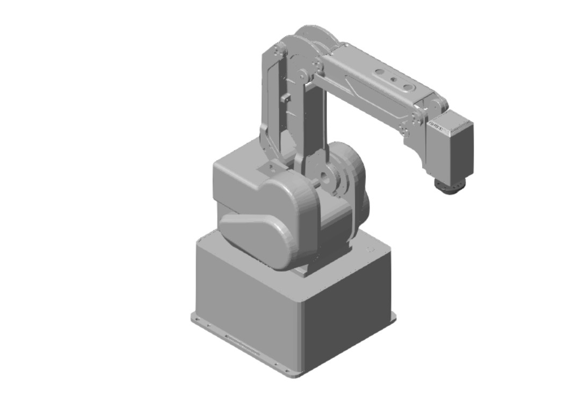

# DOBOT MG400 Interactive Model for Simscape Multibody

[](https://doi.org/10.5281/zenodo.23069741)
[](https://www.mathworks.com/products/matlab.html)
[](https://www.mathworks.com/products/simulink.html)
[](https://www.mathworks.com/products/simscape-multibody.html)
[](LICENSE)
[](https://github.com/Antonio-AE-CES/dobot-mg400-simscape/commits/main)

<p align="center">
  
</p>

An interactive educational model of the **DOBOT MG400** built with **MATLAB, Simulink, Simscape, and Simscape Multibody**.

The model is based on the official DOBOT MG400 URDF and mesh assets and provides an interactive dashboard for commanding the robot's four independent joints while reproducing the auxiliary joint relationships of the MG400 mechanism.

> **Scope:** this repository provides an interactive prescribed-motion / kinematic demonstrator for education and visualization. It is **not presented as a validated digital twin** of the physical robot.

## Features

- Interactive control of the four independent MG400 joints from a Simulink Dashboard.
- Simscape Multibody visualization in Mechanics Explorer.
- Explicit implementation of the auxiliary/mimic joint relationships from the official MG400 URDF.
- Official MG400 STL geometry.
- MG400 end-flange visualization using the official DOBOT STEP model downloaded separately by the user.
- Portable relative file references for the model assets.
- RUN, HOME, and STOP controls for classroom and demonstration use.

## Requirements

Developed and tested with:

- MATLAB R2026a
- Simulink
- Simscape
- Simscape Multibody

Earlier MATLAB releases have not been validated with this repository.

## Quick Start

### 1. Download the repository

Clone the repository or download it as a ZIP:

```bash
git clone https://github.com/Antonio-AE-CES/dobot-mg400-simscape.git
```

### 2. Download the official MG400 end-flange model

The file

```text
MG400_End_Flange_3D.stp
```

is intentionally **not redistributed** with this repository.

Download [`DOBOT MG400_End_Flange_3D`](https://www.dobot-robots.com/service/download-center/287.html)
from the official DOBOT Download Center.

Place the file in the repository root, next to:

```text
MG400_DigitalTwin_Interactive.slx
```

The expected layout is:

```text
dobot-mg400-simscape/
├── MG400_DigitalTwin_Interactive.slx
├── MG400_End_Flange_3D.stp        <-- downloaded separately
├── mg400.jpg
├── mg400_description.urdf
├── mg400_description/
│   └── meshes/
│       ├── base_link.STL
│       ├── link1.STL
│       ├── link2_1.STL
│       ├── link2_2.STL
│       ├── link3_1.STL
│       ├── link3_2.STL
│       ├── link4_1.STL
│       ├── link4_2.STL
│       └── link5.STL
├── LICENSE
├── THIRD_PARTY_NOTICES.md
└── third_party/
    └── licenses/
        └── DOBOT_MG400_ROS_LICENSE.txt
```

### 3. Open the Simulink model

Open:

```text
MG400_DigitalTwin_Interactive.slx
```

### 4. Run the simulation

Use the Dashboard controls to command joints **J1–J4** and press **RUN**.

The **HOME** control returns the commanded joints to the home configuration.  
Use **STOP** to stop the simulation.

## Dashboard Joint Ranges

The interactive interface uses conservative command limits:

| Joint | Dashboard range |
|---|---:|
| J1 | -170° to +170° |
| J2 | -8° to +75° |
| J3 | 0° to +75° |
| J4 | -170° to +170° |

These limits are chosen for the interactive demonstrator and should not be interpreted as a substitute for the manufacturer's complete operating specifications.

## Model Architecture

The MG400 mechanism contains four independently commanded joints and additional mechanically related joints.

The Simscape model explicitly generates the auxiliary joint commands from the independent coordinates according to the relationships defined in the official MG400 URDF.

The current demonstrator uses **prescribed joint position motion**. Gravity is disabled because the objective of this version is interactive kinematic visualization rather than dynamic actuator or structural simulation.

## What This Model Is — and Is Not

This repository is intended for:

- robotics education;
- Simscape Multibody demonstrations;
- studying URDF-to-Simscape workflows;
- visualizing the MG400 kinematic structure;
- experimenting with interactive joint commands.

The current version does **not** claim:

- experimentally validated robot dynamics;
- motor, gearbox, friction, or actuator models;
- torque or power prediction;
- contact-force validation;
- quantitative comparison against a physical MG400;
- TCP/IP or hardware-in-the-loop control;
- validated digital-twin fidelity.

These are natural directions for future extensions.

## Repository Contents

| Path | Description |
|---|---|
| `MG400_DigitalTwin_Interactive.slx` | Interactive Simulink / Simscape Multibody model |
| `mg400.jpg` | Project-generated MG400 model image used by the Simulink mask |
| `mg400_description.urdf` | Official MG400 URDF asset |
| `mg400_description/meshes/` | Official MG400 STL mesh assets |
| `THIRD_PARTY_NOTICES.md` | Third-party attribution and redistribution notes |
| `third_party/licenses/` | Original third-party license texts |

## Third-Party Assets and Attribution

The MG400 URDF and STL mesh assets are derived from the official DOBOT MG400_ROS repository:

https://github.com/Dobot-Arm/MG400_ROS

Copyright (c) 2022 Dobot.

Those assets are distributed under the MIT License. The original license text is preserved in:

```text
third_party/licenses/DOBOT_MG400_ROS_LICENSE.txt
```

See [`THIRD_PARTY_NOTICES.md`](THIRD_PARTY_NOTICES.md) for complete attribution and redistribution information.

The official MG400 end-flange STEP file is **not** included in this repository and must be obtained directly from DOBOT.

## License

The original work in this repository is released under the [MIT License](LICENSE).

Third-party assets retain their original copyright and licensing terms. See [`THIRD_PARTY_NOTICES.md`](THIRD_PARTY_NOTICES.md).

## Citation

If you use this model in academic or educational work, please cite the software using the metadata provided in [`CITATION.cff`](CITATION.cff).

For version 1.0.0:

```text
A. Gallardo Montti, "DOBOT MG400 Interactive Model for Simscape Multibody,"
version 1.0.0, 2026.
DOI: [10.5281/zenodo.23069741](https://doi.org/10.5281/zenodo.23069741)
```

GitHub also provides a **Cite this repository** option based on the machine-readable [`CITATION.cff`](CITATION.cff) file.

## Authors

**Antonio Gallardo Montti**  
Computational Enterprise Simulations (CES Latam)  
Santiago, Chile

## Disclaimer

This is an independent educational project and is not an official DOBOT or MathWorks product.

DOBOT and MG400 are referenced solely to identify the modeled robotic platform. MATLAB, Simulink, Simscape, and Simscape Multibody are products of The MathWorks, Inc.

---

<p align="center">
  <b>Interactive robotics education with MATLAB, Simulink, and Simscape Multibody.</b>
</p>

<!--
MATLAB FILE EXCHANGE BADGE

After the repository is published on MATLAB File Exchange, paste the official
File Exchange badge Markdown generated by MathWorks here near the top of this
README.
-->
